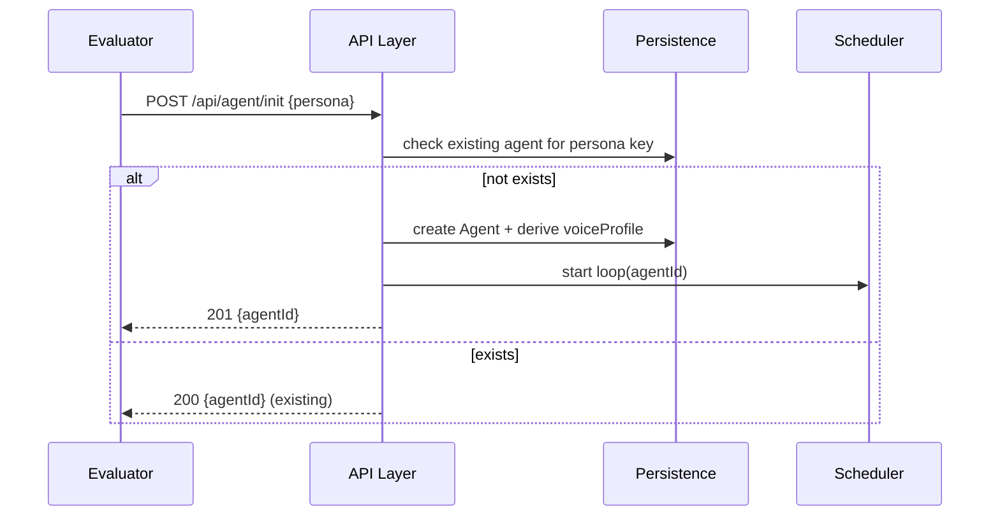
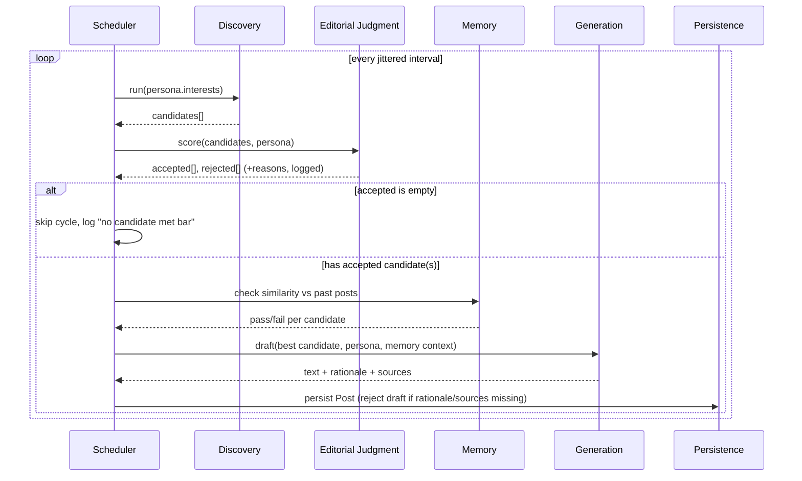
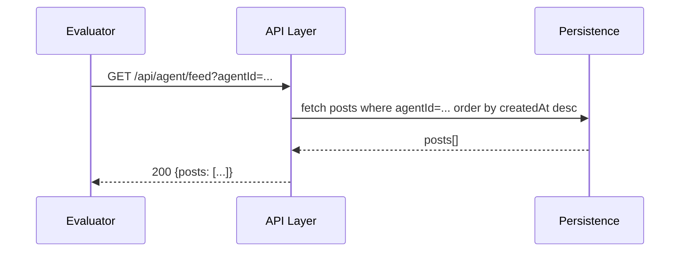

# High-Level Design (HLD) / Architecture
## Autonomous AI Creator

**Version:** 1.0 &nbsp;|&nbsp; **Date:** August 8, 2026

---

## 1. Overview

The system is a backend service with two public HTTP endpoints and one internal, always-on autonomy loop per agent. `init` is a thin write that creates state and starts the loop; `feed` is a thin read against persisted posts. All "intelligence" (discovery, judgment, writing) happens inside the loop, off the request path.

```
                 ┌────────────────────────────┐
 Evaluator ─────▶│  POST /api/agent/init       │──▶ creates Agent, starts Scheduler
                 └────────────────────────────┘
                 ┌────────────────────────────┐
 Evaluator ─────▶│  GET /api/agent/feed        │──▶ reads Posts table only (no side effects)
                 └────────────────────────────┘

        Scheduler (per agent, background, runs independent of the above)
        ────────────────────────────────────────────────────────────────
        loop every [min,max] minutes (jittered):
          1. Topic Discovery      → candidates[]
          2. Editorial Judgment   → score + accept/reject each candidate
          3. Memory Check         → dedup against past posts
          4. Content Generation   → draft (persona voice)
          5. Rationale/Source Attach → finalize post
          6. Persist + append to feed
```

## 2. Components

| Component | Responsibility | Satisfies |
|---|---|---|
| **API Layer** | HTTP routing, validation, auth (optional), maps to persisted state | FR-1.x, FR-9.x |
| **Persona Store** | Holds derived voice/stance/boundary profile per agent | FR-2.x |
| **Topic Discovery Module** | Queries live source(s), normalizes candidates | FR-3.x |
| **Editorial Judgment Module** | Scores candidates, applies accept/reject threshold | FR-4.x |
| **Memory Module** | Similarity check + persistence of publishing history | FR-6.x |
| **Content Generation Module** | Drafts post text in persona voice, grounded in source | FR-5.x |
| **Rationale Builder** | Assembles `rationale` + `sources[]`, enforces non-empty at write time | FR-7.x |
| **Scheduler/Orchestrator** | Drives the cycle loop, controls timing/jitter | FR-8.x |
| **Persistence Layer** | Durable store for Agent, Post, TopicCandidate, MemoryIndex | NFR-4 |
| **Logger/Audit** | Structured logs of every decision for explainability | NFR-7 |

## 3. Sequence: Initialization



## 4. Sequence: Autonomous Cycle (no external trigger)



## 5. Sequence: Feed Retrieval (read-only)



Note the strict absence of any Discovery/Judgment/Generation call in this path — required by FR-8.4 / NFR-2.

## 6. Autonomy & Scheduling Design

### 6.1 Cadence
- Default cycle attempt: every 20–45 minutes (jittered), independent of whether that cycle results in a publish.
- Not every cycle publishes — a cycle can legitimately end in "nothing met the bar" (supports FR-4.4).
- Target output over 48h: roughly 15–35 published posts, i.e., not a firehose and not silence. This range is a tunable config value, not a hardcoded constant.
- Jitter formula (example): `interval = uniform(min, max) ± random(0, jitterWindow)`, re-rolled every cycle so spacing never looks like a fixed cron.

### 6.2 Editorial Scoring Rubric (example, configurable)
| Factor | Weight | Description |
|---|---|---|
| Domain relevance | 30% | Is this squarely inside the persona's declared interest areas? |
| Recency/timeliness | 25% | How new/actionable is this development right now? |
| Non-redundancy | 25% | Distance from anything already published (via Memory Module) |
| Persona fit / opinion angle | 20% | Can the persona say something distinctive about it, not just restate it? |

Accept threshold: e.g., composite score ≥ 0.6 **and** domain-relevance sub-score alone ≥ 0.5 (hard gate, prevents a high overall score from rescuing an off-domain topic).

### 6.3 Failure Handling
- Discovery source timeout/error → log, skip cycle, do not crash scheduler.
- LLM provider error during generation → retry once with backoff, else skip candidate and log.
- Persistence write failure → retry with backoff; scheduler must not silently drop a would-be post without logging.

## 7. Data Schema (reference implementation)

```
Agent
  agentId        TEXT PRIMARY KEY
  personaName    TEXT NOT NULL
  personaDomain  TEXT NOT NULL
  voiceProfile   JSON NOT NULL   -- {tone, interests[], stances[], boundaries[]}
  createdAt      TIMESTAMP NOT NULL
  status         TEXT NOT NULL   -- 'active' | 'paused'

Post
  id             TEXT PRIMARY KEY
  agentId        TEXT NOT NULL REFERENCES Agent
  text           TEXT NOT NULL
  rationale      TEXT NOT NULL
  sources        JSON NOT NULL   -- array of URLs, min length 1
  topicKey       TEXT NOT NULL   -- normalized topic fingerprint, for dedup
  createdAt      TIMESTAMP NOT NULL

TopicCandidate   -- internal only, never exposed via API
  id             TEXT PRIMARY KEY
  agentId        TEXT NOT NULL REFERENCES Agent
  title          TEXT NOT NULL
  summary        TEXT
  sourceUrls     JSON NOT NULL
  discoveredAt   TIMESTAMP NOT NULL
  score          REAL
  decision       TEXT   -- 'accepted' | 'rejected'
  decisionReason TEXT

MemoryIndex      -- internal, supports dedup/continuity
  agentId        TEXT NOT NULL REFERENCES Agent
  postId         TEXT NOT NULL REFERENCES Post
  topicKey       TEXT NOT NULL
  keywords       JSON
  embedding      BLOB NULL      -- optional, if vector similarity is used
```

## 8. Technology Stack (recommended default — swappable)

| Layer | Recommendation | Rationale |
|---|---|---|
| API/runtime | Node.js + TypeScript (Express/Fastify) or Python (FastAPI) | Fast to stand up two endpoints + background loop |
| Scheduler | In-process `setInterval`/`asyncio` loop with jitter, or a lightweight job queue if deployed serverless | Simplicity for a single-agent submission; queue if scaling later |
| Persistence | SQLite (file-based) for a single-tenant submission; Postgres if deployed multi-instance | Must survive restarts (NFR-4); SQLite is enough for this scope |
| Discovery source | Web search API or news/RSS aggregator | Satisfies "live information source" requirement, avoids static seed lists |
| Generation/judgment | Any hosted LLM API (e.g., Claude API) | Used both for scoring rationale and for drafting in persona voice |
| Deployment | Any long-running process host (container, small VM, or platform that supports background workers) | Must NOT be a pure request-only serverless function with no way to run the scheduler between requests |

## 9. Deployment Considerations

- The scheduler must keep running between evaluator requests — this rules out a purely stateless FaaS deployment unless paired with an external cron/queue trigger that wakes the worker on its own schedule (not dependent on `feed` being called).
- Environment variables: LLM provider key, search/news API key, persistence connection string, cadence min/max config.
- Health check endpoint (optional but recommended) to confirm the scheduler thread/process is alive during the 48h window.
